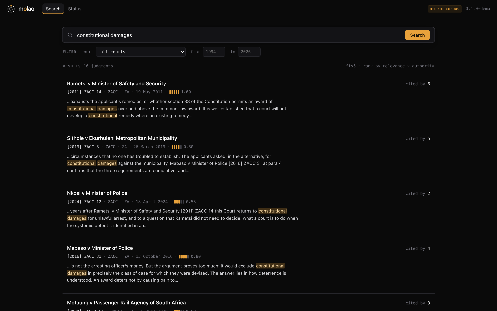
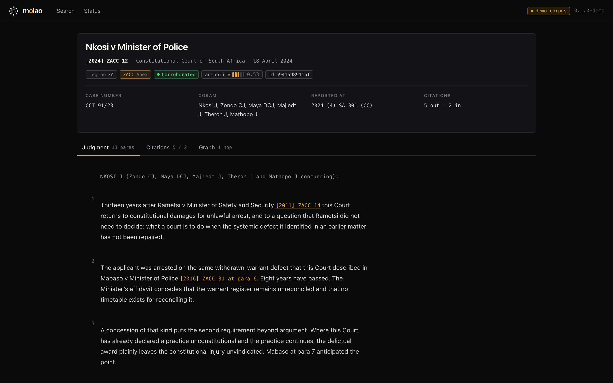
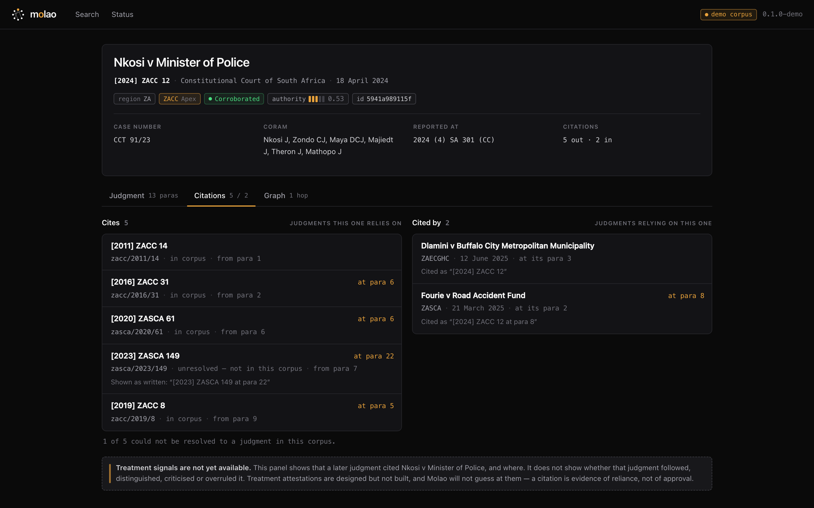
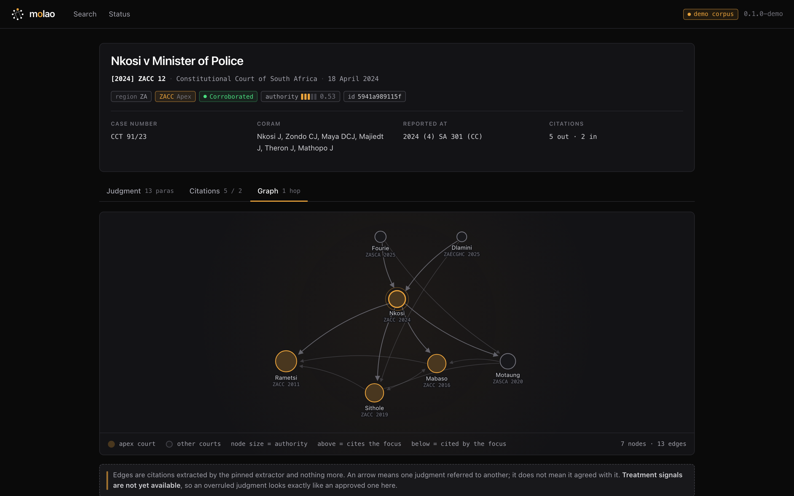
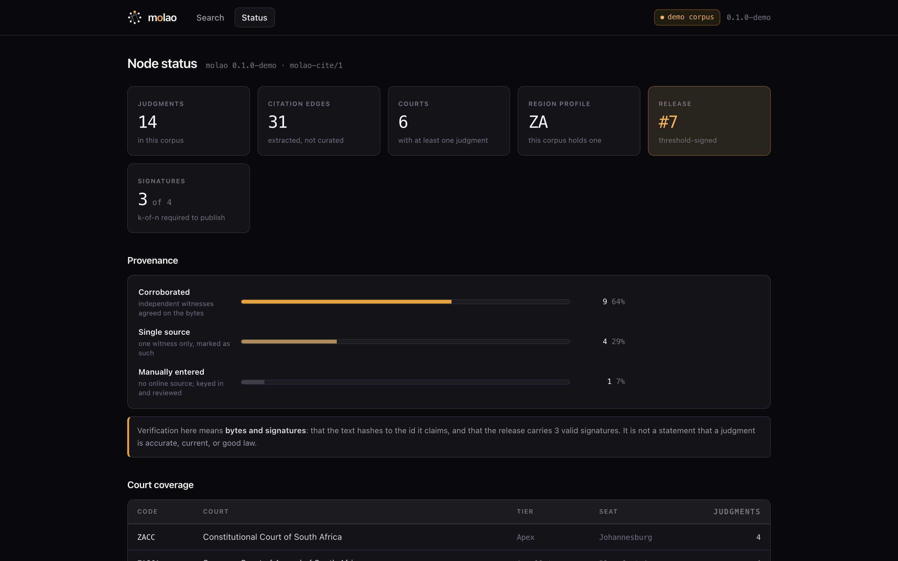
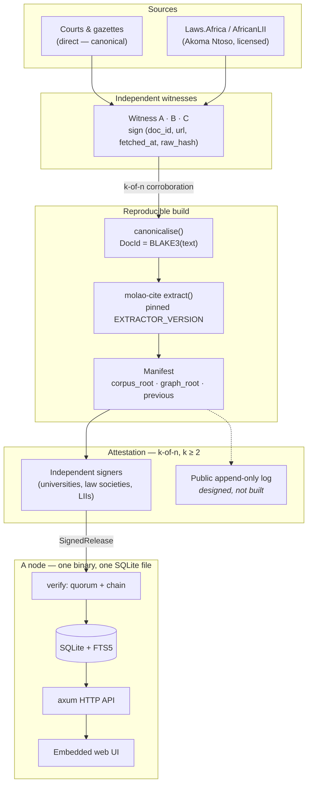

<p align="center">
  <picture>
    <source media="(prefers-color-scheme: dark)" srcset="assets/brand/logo-wordmark-dark.svg">
    
  </picture>
</p>

<p align="center"><strong>The law, held in common.</strong></p>

<p align="center">
  <a href="#quick-start-standalone">Quick start</a> ·
  <a href="#features">Features</a> ·
  <a href="#screenshots">Screenshots</a> ·
  <a href="#how-it-works">How it works</a> ·
  <a href="#documentation">Docs</a> ·
  <a href="GOVERNANCE.md">Governance</a> ·
  <a href="ROADMAP.md">Roadmap</a>
</p>

<!-- Plain-text badges on purpose: rendering this README triggers no external
     image fetches — the same no-network-calls ethos as the node. -->
<p align="center"><sub><a href="LICENSE-MIT">MIT</a> OR <a href="LICENSE-APACHE">Apache-2.0</a> · Rust 1.85+ · SQLite + FTS5 · TypeScript UI · offline-first · no accounts, no billing, ever</sub></p>

<p align="center">
  
  <br>
  <sub><em>Search across the corpus. Every judgment carries its court, neutral citation, provenance class and inbound-citation weight. All screenshots use the demo corpus — there is no bundled corpus yet (<a href="docs/SCREENSHOTS.md">full tour</a>).</em></sub>
</p>

<table align="center">
  <tr>
    <td align="center" width="33%"><strong>Free, forever</strong><br><sub>No accounts, no telemetry, no billing, no hosted service. Universities, firms and individuals run nodes. Nobody bills anybody.</sub></td>
    <td align="center" width="33%"><strong>Verifiable by recomputation</strong><br><sub>Judgment ids are BLAKE3 of canonical text. The citation graph comes from a pinned extractor anyone can re-run and compare byte for byte.</sub></td>
    <td align="center" width="33%"><strong>No single publisher</strong><br><sub>Releases need k-of-n signatures from independent organisations. A threshold below 2 is refused in code — including for us.</sub></td>
  </tr>
</table>

## What is Molao?

**Molao** (Sotho and Tswana for *law*) is a free, decentralized commons of case
law: a corpus of judgments, a citation graph over them, and a single binary that
serves both. It is not a product and not a business. There is no hosted service
to sign up for, no subscription, and no plan to add one.

A node is one executable over one SQLite file. It works fully offline, makes no
outbound requests of its own, and needs nothing from anyone to keep serving the
law. Judgments are identified by the hash of their canonical text, so two nodes
that have never exchanged a packet agree on what a judgment is, and a release is
signed by a quorum of independent organisations rather than published by one
operator who could be pressured, bought, or breached.

Molao is **infrastructure any jurisdiction can stand up for its own corpus** —
an LII, a law faculty, a bar council, a ministry of justice. It is the model the
LII network (AustLII, CanLII, BAILII, SAFLII, NZLII, the AfricanLII members) has
run for decades under the Free Access to Law Movement, and Molao is joining that
tradition rather than inventing it. What it adds is content-addressed identity,
threshold-signed releases, and a citator whose mechanical layer can be checked
by anyone.

### Regions are data, not code

**No jurisdiction is hardcoded.** Court codes, court names, hierarchy tiers,
authority weights and law-report series ship as **region profiles** — data a
node picks, never an assumption baked into the parser. A **generic** profile
makes Molao usable anywhere on day one, and **South Africa (`ZA`) is the first
fully-populated profile**, never a special case.

This works because the free-access-to-law world already converged on one
citation convention:

| Jurisdiction | Neutral citation | Published by |
|---|---|---|
| United Kingdom | `[2020] UKSC 1` | BAILII |
| Australia | `[2020] HCA 1` | AustLII |
| New Zealand | `[2020] NZSC 1` | NZLII |
| South Africa | `[1995] ZACC 3` | SAFLII |

Same grammar, different court codes — which is exactly why the codes belong in
data. Adding a jurisdiction means supplying a profile (court registry, tiers,
weights, report series, applicable citation styles) and touching no core logic:
[docs/COURTS.md](docs/COURTS.md#adding-a-jurisdiction). Nothing about that
changes for Kenya, Nigeria, or any of the roughly sixteen AfricanLII member
jurisdictions — the citation grammar is already shared continent-wide; only
the court registry differs, and that is data, not code.

> [!NOTE]
> **Status: 0.1.0, early — decentralisation-ready, not decentralisation-running.**
> The trust model is real, and it is built and tested today: hash-identified
> judgments, threshold-signed releases, a citation graph verifiable by
> recomputation, and a node that runs standalone and fully offline. Region
> profiles load from TOML — `ZA` populated, `GENERIC` anywhere, though
> `GENERIC` finds only neutral citations and case numbers because reported
> citations need an enumerated report-series list.
>
> What is **not** live yet: peer-to-peer distribution and a public corpus.
> **There is no bundled corpus — a node starts empty**, and `molao demo` seeds
> a synthetic one. No public signed release exists yet, and releases still
> move as plain files, mirrored by hand. Three crates are landing this
> session to close that gap: **`molao-ingest`** (a robots-respecting,
> collectively-built corpus — witnesses fetch and sign independently;
> corroboration, not upload trust), **`molao-dist`** (content-addressed
> releases over iroh, with a torrent export and HTTP mirror as fallback
> transports), and **`molao-index`** (a local vector+keyword search cache,
> rebuildable and unsigned, never part of a release). None has run against
> real data yet. Treatment attestations remain **designed, not built**.
> Semantic search over a release is **deliberately excluded**
> ([why](docs/THREAT-MODEL.md#why-embeddings-are-excluded-from-releases)) —
> a local rebuildable cache is not the same thing and does not reopen that
> question. Full status in [ROADMAP.md](ROADMAP.md).

## Features

<table>
  <tr>
    <th align="left" width="50%">⚖️ For reading the law</th>
    <th align="left" width="50%">🔗 For trusting it</th>
  </tr>
  <tr>
    <td valign="top">
      <ul>
        <li>Full-text search over the corpus (SQLite FTS5) with court, year-from and year-to filters, and <code>&lt;mark&gt;</code>-highlighted snippets</li>
        <li>Judgments as structured documents — parties, court, case numbers, date, coram, parallel reported citations, and numbered paragraphs</li>
        <li>Citations both ways: cases this judgment cites, and cases citing it, each with the paragraph it was cited from and the pinpoint it pointed at</li>
        <li><strong>Unresolved citations shown as written</strong>, never hidden. A citator that quietly drops what it cannot resolve tells a lawyer the case cites less than it does</li>
        <li>Citation graph around any judgment, weighted by the citing court's place in the hierarchy</li>
        <li>Authority ranking from inbound citations weighted by court tier — an appellate judgment relying on a case says more than a first-instance one does</li>
        <li>Works completely offline. Pull the plug and it keeps working</li>
      </ul>
    </td>
    <td valign="top">
      <ul>
        <li>Judgment ids are <strong>BLAKE3 of canonical text</strong>. Alter a paragraph and the id no longer matches — which is what makes a judgment from an untrusted peer safe to keep</li>
        <li><strong>Threshold-signed releases</strong>: k-of-n independent organisations, <code>threshold &gt;= 2</code> refused below that in code, one signer one vote, outsiders ignored however valid their signature</li>
        <li>Releases <strong>chain by hash</strong>, so a fork is detectable against any known head</li>
        <li><strong>Provenance on every judgment</strong> — Corroborated, Single source, or Manually entered — because lawyers already reason in reported versus unreported terms</li>
        <li>Contributed documents corroborated by <strong>k-of-n independent re-fetch</strong>: witnesses sign the bytes they saw at the canonical source</li>
        <li><strong>Deterministic citation extraction</strong> pinned to <code>EXTRACTOR_VERSION</code>, so anyone can rebuild the graph and compare it byte for byte</li>
        <li>The node verifies bytes and signatures. It <strong>never</strong> claims a judgment is verified law</li>
      </ul>
    </td>
  </tr>
</table>

**Honest about the hard parts**

- **The citator is the real prize, and its interpretive half is not built.** A
  corpus that does not know case A was overruled by case B will hand a lawyer
  dead authority. Mechanical citation edges are deterministic and verifiable, and
  those exist. Treatment labels (followed / distinguished / overruled) are
  interpretation — they will be **signed attestations that may conflict, showing
  disagreement rather than resolving it**, and they are **designed, not built**.
  Until then, check currency yourself.
- **"No central server" is achievable; "no central authority" is not.** Somebody
  must attest that a hash is the real judgment. So the trust root is a quorum
  plus a public append-only log, not one operator. That is a large improvement
  over one database with one administrator, and it is not trustlessness.
  [GOVERNANCE.md](GOVERNANCE.md)
- **Federations decay when the person running the node leaves.** Hence a
  zero-maintenance single binary with no external database and nothing to
  rotate, plus network health exposed publicly on `/api/status`.
  [docs/RUNNING-A-NODE.md](docs/RUNNING-A-NODE.md)
- **Sourcing is an ethical position, not a technical one.** Courts and
  gazettes directly, a polite robots-respecting crawl where that is all a
  court publishes, licensed bulk data from Laws.Africa / AfricanLII, and
  SAFLII treated as a citation-resolution target rather than a scrape target.
  No single upload is trusted either way: the corpus is built **collectively**,
  and a document counts only once independent witnesses corroborate it.
  [docs/SOURCES.md](docs/SOURCES.md)
- **Decentralised in trust; not yet in distribution.** The parts that are
  built are the parts that matter most: content-addressed identity,
  threshold signatures, a recomputable graph, offline nodes. The part that
  is not yet live is moving a release peer-to-peer and having a public
  corpus to move. `molao-dist` (content-addressed releases over iroh, a
  torrent export, an HTTP mirror) is landing this session and closes the
  distribution half; it does not by itself create a public corpus.
  [docs/DISTRIBUTION.md](docs/DISTRIBUTION.md)

## Screenshots

The web UI running against the **demo corpus** — synthetic judgments with a real
citation graph between them. There is no bundled corpus yet. Full tour in
[docs/SCREENSHOTS.md](docs/SCREENSHOTS.md).

<table>
  <tr>
    <td width="50%"><br><sub><em>A judgment — numbered paragraphs as printed, court, case number, coram, parallel reported citations, and its provenance class</em></sub></td>
    <td width="50%"><br><sub><em>Citations both ways, with the paragraph cited from and the pinpoint cited to. Unresolved citations appear as written rather than being dropped</em></sub></td>
  </tr>
  <tr>
    <td width="50%"><br><sub><em>The citation graph around one judgment, edges weighted by the citing court's tier</em></sub></td>
    <td width="50%"><br><sub><em>Node status — release number, quorum and threshold, provenance breakdown, court coverage, and whether verification passed</em></sub></td>
  </tr>
</table>

## Quick start (standalone)

Molao runs by itself. It has no dependency on any hosted service or on a
network.

### Prerequisites

Rust 1.85 or newer, and Node 20 or newer for the web UI. Nothing else — SQLite
is bundled by `rusqlite`, so there is no database to install and no connection
string to configure.

### Build and test

```sh
git clone https://github.com/vul-os/molao
cd molao

cargo build --workspace
cargo test --workspace
```

The tests are the fastest way to see what the project guarantees: that
canonicalisation is idempotent, that tampering with a judgment breaks its id,
that one signer cannot reach a quorum by signing repeatedly, and that ordinary
prose extracts no citations.

### Build the UI and run a node

```sh
npm ci
npm run build

cargo run -p molao-node
```

The node binds `127.0.0.1` and serves the [HTTP API](docs/API.md) plus the
embedded UI.

> **The node crate and UI are in progress.** The API contract is specified and
> the core crates are complete, but the server is still being written. Run
> `cargo run -p molao-node -- --help` to see what your clone actually offers.

### There is no corpus yet

**A node starts empty.** Molao ships no bundled corpus, and no public signed
release exists. `molao demo` seeds a small synthetic corpus so you can see
search, judgments, citations and the graph working — it is part of the same
in-progress work as the server above.

To ingest real documents, read [docs/SOURCES.md](docs/SOURCES.md) first. The
sourcing rules are a deliberate ethical position.

## Where the law comes from

A July 2026 sweep of the free-access-to-law world found the honest shape of the
problem: **the LII aggregators mostly forbid AI use.** Most publish a
`robots.txt` `Content-Signal: ai-input=no`, or block AI crawlers, or say so in
their terms. Molao honours that — its crawler reads the signal and, by default,
will not ingest a source that declines AI input into the corpus (which feeds a
RAG index). It never disguises itself to get around a control: it always
identifies as `molao-node`, always obeys `robots.txt`, and there is no
browser-spoofing option. See [docs/CONTENT-SIGNALS.md](docs/CONTENT-SIGNALS.md).

So the corpus comes from **courts and official publishers directly, or under
licence** — the honest inversion of where you'd instinctively start. The full
per-jurisdiction map is [docs/SOURCE-MAP.md](docs/SOURCE-MAP.md); `molao sources`
prints the crawler's live registry. In brief:

| Status | Jurisdictions |
|---|---|
| 🟢 **Usable now** | New Zealand, Kenya, Ghana, Scotland, Northern Ireland, South Africa (Constitutional Court direct — SA judgments are public domain by statute) |
| 🟡 **A free paperwork step away** | England & UK Supreme Court (National Archives API, Akoma Ntoso), Ireland, Australia, federal Canada |
| 🟡 **Via a Laws.Africa licence** | Most of Africa, as bulk |
| 🔵 **Preliminary** | EU (EUR-Lex/CJEU), France, Netherlands, Germany |
| 🔴 **Off-limits by their policy** | BAILII, AustLII, NZLII, CanLII, SAFLII |

**This is where an open-source community moves faster than any one team.** The
code adapters (a court-direct parser for New Zealand, Ghana, the SA
Constitutional Court, EUR-Lex) are pick-up tasks behind one trait; a new
jurisdiction's court codes are a TOML [region profile](docs/COURTS.md#adding-a-jurisdiction);
and the biggest unlocks are **licence applications a person files** — drafted and
ready in [`paperwork/`](paperwork/). See the contribution list in
[docs/SOURCE-MAP.md](docs/SOURCE-MAP.md#how-the-community-can-help).

### Use the crates on their own

Both core crates work standalone, with no node and no network. If all you want
is a citation parser for your jurisdiction, `molao-cite` plus a region profile is that:

```rust
use molao_cite::{extract, Pinpoint};

let refs = extract("as held in S v Makwanyane [1995] ZACC 3 at para 87");
assert_eq!(refs[0].citation.key(), "neutral:1995:ZACC:3");
assert_eq!(refs[0].pinpoint, Some(Pinpoint::Paragraph { from: 87, to: None }));
```

## How it works

Sources are fetched by independent witnesses who sign the bytes they saw. A
builder canonicalises the text, extracts citations with a pinned extractor, and
produces a manifest. A quorum of independent organisations signs it. A node
verifies the quorum and the chain, then serves the corpus locally — offline,
forever, with nothing to phone home to.



Two absences are deliberate. There is **no server a node must reach** to
function: a node with a corpus on disk needs no peers and no internet. And there
is **no embedding or vector index anywhere**, because float inference is not
reproducible across hardware — so a contributed index could never be verified —
and a poisoned index is worse than a poisoned document, since the text stays
correct while retrieval quietly steers.

Between nodes there is no hub. Every node holds a full copy. A release is a
content-addressed file set plus a signed manifest, so it can travel over
iroh, as a torrent export, or as a plain HTTP mirror — verified identically
regardless of which one carried it. iroh and the torrent export are
**landing this session** as `molao-dist`
([docs/DISTRIBUTION.md](docs/DISTRIBUTION.md)); today a plain file host,
mirrored by hand, is still the only transport actually moving bytes, because
there is no public corpus yet to move. P2P will never be *required* to read
the law — a node with a corpus on disk needs no peers at all.

## Configuration

There is nothing to configure to read the law. No config file is required, no
database to point at, no credentials, no account, and no service endpoint.

| What | Default | Note |
|---|---|---|
| Bind address | `127.0.0.1` | Serving a network is a deliberate flag, not an accident |
| Storage | one SQLite file | Bundled; no external database |
| Network calls | none | A node makes no outbound requests of its own |
| Telemetry | none | There is no code to disable |

Node roles, what each costs to run, and the practical guidance are in
[docs/RUNNING-A-NODE.md](docs/RUNNING-A-NODE.md).

## Documentation

| Document | What it covers |
|---|---|
| [GETTING-STARTED.md](docs/GETTING-STARTED.md) | Clean clone to a running node, and what does not work yet |
| [ARCHITECTURE.md](docs/ARCHITECTURE.md) | The binding contract: layers, identity, canonicalisation, storage, non-negotiables |
| [CITATIONS.md](docs/CITATIONS.md) | The citation grammar the parser implements — neutral, reported, historical, case numbers, pinpoints, keys; and which parts are profile-driven |
| [COURTS.md](docs/COURTS.md) | The region-profile contract, the shared tier model, and how to add a jurisdiction |
| [RELEASES.md](docs/RELEASES.md) | Threshold signing, manifest chaining, content-addressed packaging, and how to verify a release yourself |
| [DISTRIBUTION.md](docs/DISTRIBUTION.md) | How a release travels: content-addressed packaging, iroh, torrent export, HTTP mirror, and verification on receipt (landing this session) |
| [PROVENANCE.md](docs/PROVENANCE.md) | Witnesses, corroboration, and the Corroborated / Single / Manual classes — the model that lets a corpus be built collectively |
| [THREAT-MODEL.md](docs/THREAT-MODEL.md) | Poisoning, split view, why embeddings are excluded, why a rebuildable RAG cache doesn't reopen that, distribution over untrusted transports, and what is **not** protected |
| [SOURCES.md](docs/SOURCES.md) | How to source responsibly in any jurisdiction: direct, robots-respecting crawl, licensed bulk, and why an LII that declines bulk supply is not scraped |
| [SOURCE-MAP.md](docs/SOURCE-MAP.md) | The live per-jurisdiction map: what is usable now, what needs an adapter, what needs a licence — and how to help |
| [CONTENT-SIGNALS.md](docs/CONTENT-SIGNALS.md) | How the crawler reads `Content-Signal` and AI-crawler blocks, and the three layers (identity, robots, signal) — which are absolute and which is a policy |
| [RUNNING-A-NODE.md](docs/RUNNING-A-NODE.md) | The four roles — Mirror, Witness, Builder, Attestor — and what each costs |
| [API.md](docs/API.md) | The node's read-only HTTP API, endpoint by endpoint |
| [SCREENSHOTS.md](docs/SCREENSHOTS.md) | The screenshot set and how to regenerate it |
| [FAQ.md](docs/FAQ.md) | Straight answers, including the ones that are "not yet" |

Also: [GOVERNANCE.md](GOVERNANCE.md) (the signer set, and what "decentralized"
honestly means here), [ROADMAP.md](ROADMAP.md) (phases, with what is done, in
progress, designed-not-built, and deliberately excluded),
[SECURITY.md](SECURITY.md), [CHANGELOG.md](CHANGELOG.md).

## Development

```sh
# Rust workspace
cargo build --workspace
cargo test --workspace
cargo clippy --all-targets -- -D warnings
cargo fmt --all -- --check

# Web UI
npm ci
npm run build
npm run typecheck
npm run lint
```

CI runs exactly these ([.github/workflows/ci.yml](.github/workflows/ci.yml)).

Every crate is `#![forbid(unsafe_code)]`. Determinism in `molao-cite` is a hard
contract, not a preference: no hash-map iteration order in output, no locale, no
clock, and **any change to extraction behaviour bumps `EXTRACTOR_VERSION`** —
including adding a court or a law-report series. Read
[docs/ARCHITECTURE.md](docs/ARCHITECTURE.md) before changing anything
structural; it is the contract.

## Contributing

Contributions welcome, and some of the most useful ones involve no code:
citation-parser test cases from real judgments that are mis-parsed, court and
series registry corrections, running a node, and the institutional work of
assembling a genuinely independent signer set. See
[CONTRIBUTING.md](CONTRIBUTING.md).

## License

[MIT](LICENSE-MIT) OR [Apache-2.0](LICENSE-APACHE) — © Molao contributors.
Source and issues at
[github.com/vul-os/molao](https://github.com/vul-os/molao). The judgments
themselves are not anyone's to license — they are public documents, the work of
the courts.

---

<p align="center">
  <a href="https://vulos.org"></a><br>
  <sub><a href="https://vulos.org"><b>vulos</b></a> — open by design</sub>
</p>
