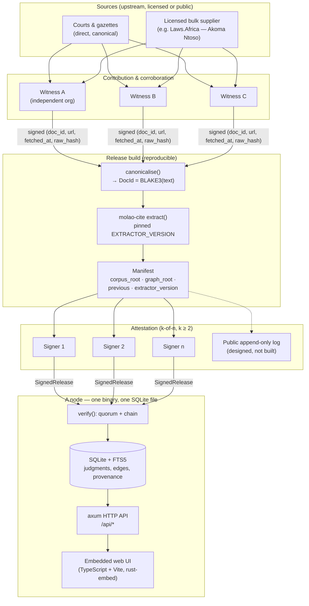

# Architecture

This is the contract. Everything else in the repo is an implementation of what
is written here, and changes to this document are changes to the project's
guarantees.

## The one-sentence version

A judgment is identified by the hash of its canonical text, a release is a
threshold-signed manifest over a set of those hashes plus the citation graph
derived from them by a pinned extractor, and a node is a single binary that
holds a copy and serves it over HTTP with no network dependency at all.

## Why it is shaped this way

Three constraints drove every decision:

1. **A lawyer must be able to read the law with no internet.** So the node is
   one binary over one SQLite file. No external database, no service to call, no
   account, no licence check. Pull the plug and it keeps working.
2. **Anyone must be able to check what anyone else contributed.** So every
   artifact in a release is reproducible: hashes of canonical text, and a graph
   produced by a versioned deterministic extractor. If it cannot be
   recomputed, it does not go in a release.
3. **No single party may control the corpus, including us.** So releases are
   k-of-n threshold-signed by independent organisations, and the code refuses a
   signer set with a threshold below 2.

## Diagram

Note what is **not** on this diagram: there is no server that a node must reach
to function, and no embedding or vector index anywhere. Both absences are
deliberate and are explained below.

## Layers

| Crate | Owns | Status |
|---|---|---|
| `molao-core` | `DocId`, `canonicalise()`, `Judgment`, `Paragraph`, `Provenance`, `ProvenanceClass`, region profiles (court registry), threshold-signed releases | Written, tested; profile refactor in progress |
| `molao-cite` | Deterministic citation extraction, profile-driven series registry, `EXTRACTOR_VERSION` | Written, tested |
| `molao-corpus` | SQLite storage, FTS5 search, ingest | In progress |
| `molao-graph` | Citation graph, authority scoring, treatment attestations | Planned |
| node binary | `axum` HTTP server, embedded UI | In progress |
| `apps/web` | TypeScript + Vite + Preact UI, embedded into the binary | In progress |

`molao-core` depends on nothing but serialisation and crypto. `molao-cite`
depends on `molao-core` for the active region profile, and on nothing else but
`regex`. Neither touches the network. That is enforced by the dependency list,
not by convention.

## Document identity

`DocId` is the BLAKE3 hash of a judgment's **canonical text**, and nothing else.
Not a row id, not a URL, not a filename. Two nodes that have never exchanged a
packet agree on what `f3a9…` is.

Canonicalisation is aggressive on purpose. Judgments arrive as RTF, PDF and
HTML, and every converter disagrees about whitespace and typography. If two
witnesses ran different converters over the same judgment and got different
ids, the network would silently fork. So `canonicalise()`:

- normalises `\r\n` and `\r` to `\n`
- maps curly quotes and apostrophes to straight ones
- maps en dash, em dash and minus to a hyphen
- maps non-breaking space, figure space, narrow no-break space and tab to a
  plain space
- collapses runs of spaces
- strips trailing whitespace per line
- drops leading and trailing blank lines, and ends with exactly one newline

It is idempotent, and there is a test that says so. Formatting is not part of a
judgment's meaning; a stable id matters more than round-tripping the source
bytes, and the raw bytes are preserved separately in the `Provenance` record
(`raw_hash`).

`Judgment::canonical_text()` joins paragraph texts with blank lines and
canonicalises the result. `Judgment::verify_id()` recomputes and compares. That
one cheap call is the single most important invariant in the system: it is what
makes a judgment received from an untrusted peer safe to keep. Tampering with
any paragraph breaks it.

## Region profiles

**No jurisdiction is hardcoded into core logic.** Court codes, names, hierarchy
tiers, authority weights and law-report series are **region profile** data; a
`generic` profile works anywhere from day one and `ZA` is the first
fully-populated one. The citation *grammar* is shared, because the LII neutral
citation convention is shared — `[2020] UKSC 1`, `[2020] HCA 1`, `[1995] ZACC
3`. Only the codes differ, which is why the codes are data.

The ZA profile carries 32 courts, keyed by neutral-citation code, each with a
name, a `Tier`, and an optional seat. `Tier` is ordered from `Apex` down to
`Lower` and carries an `authority_weight()` used to weight citation edges: an
apex-court judgment relying on a case says more about that case than an
inferior court does.

Unknown codes do not panic and do not vanish. `lookup()` returns `None`,
`authority_weight()` returns the `Lower` floor, and the citation parser keeps
the citation with `known_court: false`. Unknown does not mean unimportant; it
means we have no basis to weight it up — and it is what makes the `generic`
profile usable before anyone has written a jurisdiction's registry. The profile
contract and how to add a jurisdiction are in [COURTS.md](COURTS.md).

## The citation layer

`molao_cite::extract(&str) -> Vec<CitationRef>` is the layer the whole graph
rests on, and its contract is **determinism**:

- results sorted by byte span, then longest-first, then canonical form
- no hash-map iteration order reaches the output
- no locale, time, or environment dependence
- behaviour changes require bumping `EXTRACTOR_VERSION`

A release manifest records the extractor version that produced its graph.
Anyone can re-run that version over the same corpus and must get a
byte-identical graph. This is what lets an untrusted contributor supply a graph
that everyone else can check. Full grammar in [CITATIONS.md](CITATIONS.md).

Treatment (followed / distinguished / overruled) is explicitly **not** part of
extraction. It is interpretation, it cannot be verified by recomputation, and
it is modelled as signed attestations that may conflict. **Designed, not
built.**

## Releases

A release is a `Manifest` plus a set of `ManifestSignature`s. The manifest
names the previous manifest's hash, so releases chain and forks are detectable.
Signing bytes are hand-rolled and length-prefixed rather than `serde_json`,
because JSON field ordering and number formatting are not guaranteed stable and
a signature over a shifting representation is a signature over nothing.

`SignedRelease::verify()` fails closed at every step: unknown signers,
malformed keys and malformed signatures are ignored rather than counted, one
key counts once no matter how many times it signs, and a signer set with
threshold below 2 is refused outright even when every signature in it is valid.
Full detail in [RELEASES.md](RELEASES.md).

## Storage

`rusqlite` with bundled SQLite and FTS5. One file. No external database,
because a legal commons that needs a Postgres cluster to read is not a commons
that a rural magistrate's office or a two-person firm will ever run.

FTS5 provides full-text search and the `snippet()` function that produces the
`<mark>`-wrapped excerpts in `/api/search`. Search is lexical. See below for why
it stays that way in v1.

## Why there are no embeddings

Semantic search would be genuinely useful. It is still excluded from releases,
for a reason that is not about effort:

- **Float inference is not reproducible across hardware.** The same model on
  two machines can produce different vectors. A contributed vector index could
  therefore never be verified by recomputation, which breaks the one property
  the whole design rests on.
- **A poisoned index is worse than a poisoned document.** A tampered judgment
  fails `verify_id()` immediately. A tampered index leaves every judgment
  byte-perfect and simply never returns the case that would have lost you the
  argument. It is silent, and there is nothing to compare against.

So no embedding artifact is part of a release. A node operator is free to build
an index locally over verified text, and that is the right place for it: local,
optional, and never something anyone else has to trust. See
[THREAT-MODEL.md](THREAT-MODEL.md).

## Distribution

Today a release is a set of plain files: the manifest, the signatures, and the
corpus. Mirror it however you like — HTTPS, rsync, a hard drive in the post.

P2P distribution (`iroh`) is **designed, not built**. When it lands it will make
distribution faster and harder to censor. It will never be required to read the
law, because the offline-first guarantee outranks it.

## Non-negotiables

These do not change without changing what Molao is:

1. No hosted service, no account, no telemetry, no billing. Ever.
2. A node works fully offline.
3. Nothing enters a release that cannot be verified by recomputation.
4. No single party can publish a release. `threshold >= 2`, enforced in code.
5. Unresolved citations are shown as written, never hidden.
6. The node verifies bytes and signatures. It never claims a judgment is
   correct law.
7. No jurisdiction is hardcoded. Everything country-specific is region-profile
   data, and adding a jurisdiction must never require touching core.
