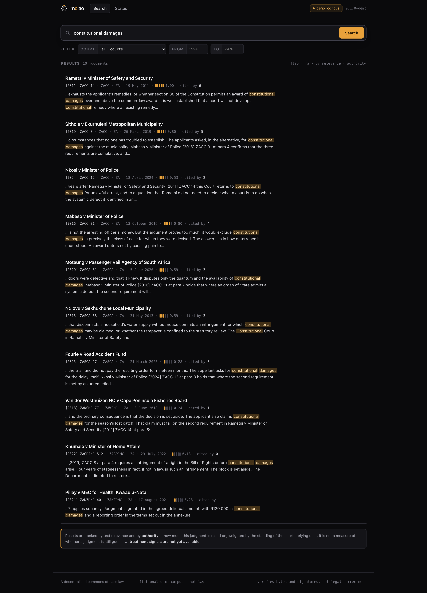
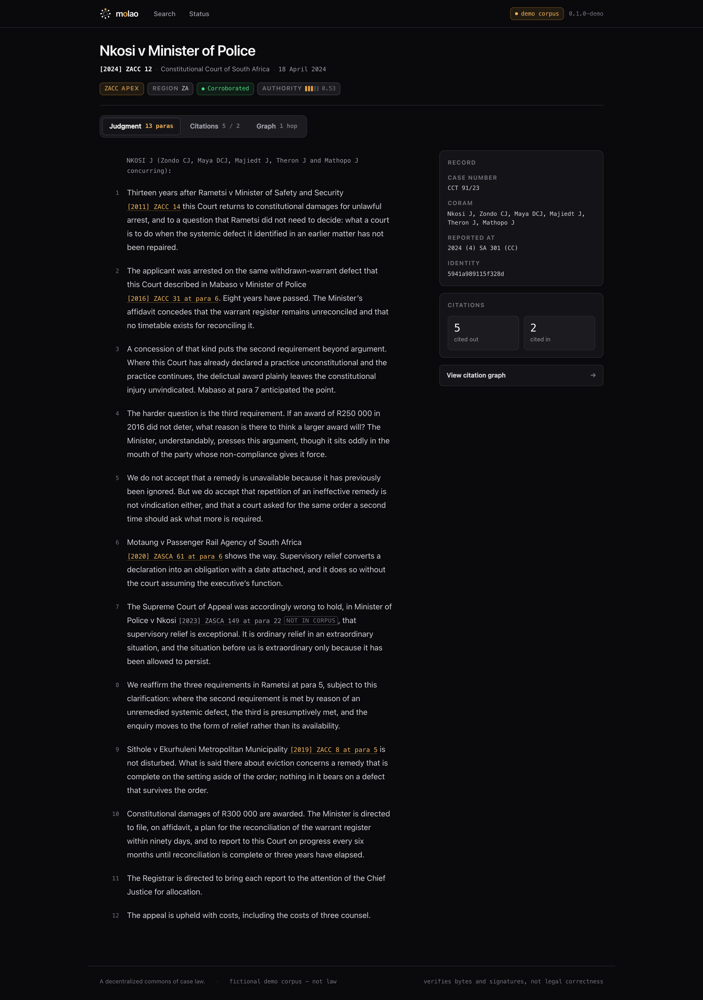
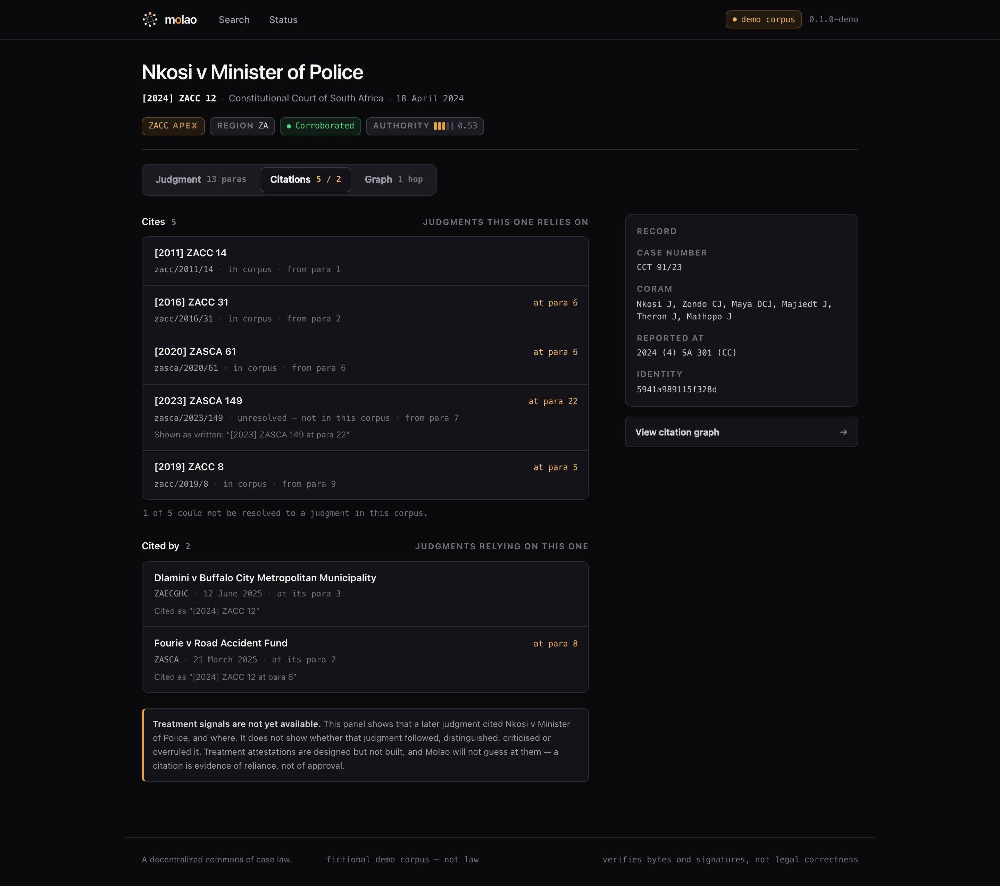
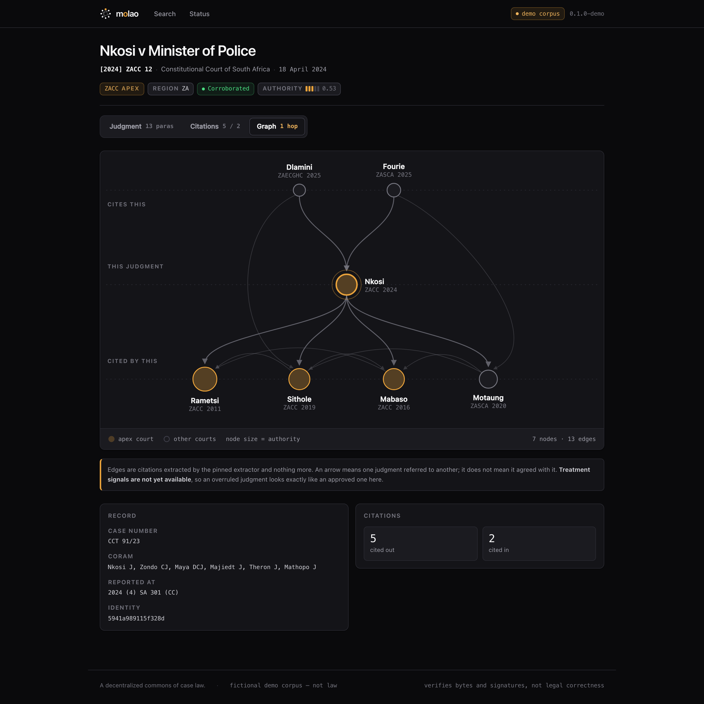
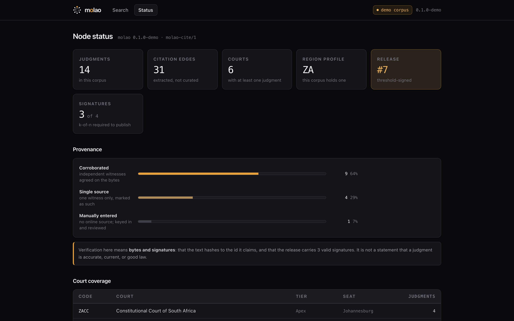
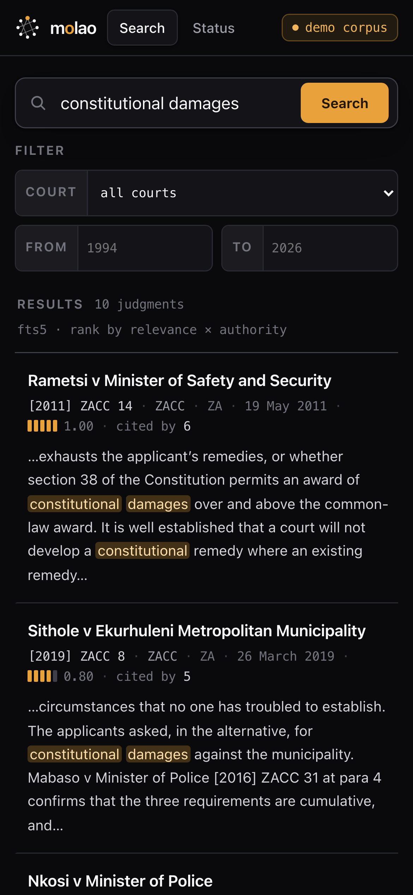
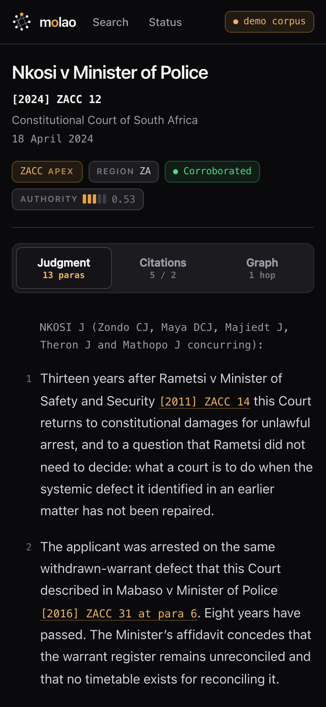
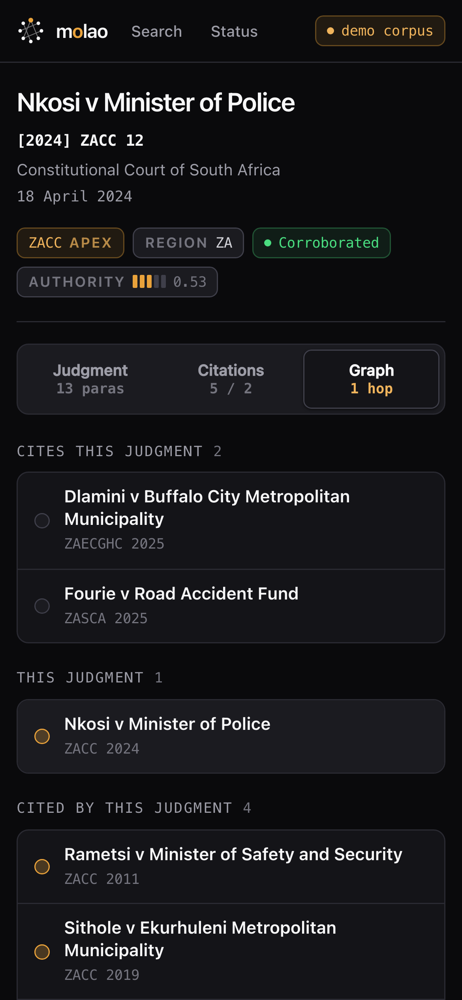

# Screenshots

Every screenshot in this repository shows the real web UI running against a
node seeded with the **demo corpus**. Nothing is mocked up, and no screenshot
shows a real judgment, because there is no bundled corpus yet.

## The set

Eight plates, five desktop and three mobile. Every one is regenerated by
`npm run screenshots` and is checked in.

### Desktop



*Search — the main view.*



*A judgment, with numbered paragraphs and its provenance class.*



*Citations both ways. Unresolved citations appear as written rather than being
dropped — a citator that quietly discards what it cannot resolve tells a lawyer
the case cites less than it does.*



*The citation graph around one judgment, weighted by the citing court's tier.*



*Node status.*

### Mobile

Mobile is a first-class target, so it is a first-class screenshot set. Below the
breakpoint the citation graph's SVG is replaced by grouped lane lists rather
than being shrunk into illegibility.







## Regenerating

```sh
npm ci
npm run build:demo
npm run screenshots
```

`build:demo` builds the UI in demo mode, which seeds the synthetic corpus so the
screenshotter needs no real backend, no corpus, and no credentials. Output goes
to `docs/screenshots/`.

The screenshotter is Playwright over Chromium. If it has not been installed
before:

```sh
npx playwright install chromium
```

> The screenshotter (`scripts/screenshots.mjs`) and the demo mode it depends on
> are part of the in-progress UI work. If `npm run screenshots` fails in your
> clone, the UI is ahead of or behind this document; check
> `apps/web/package.json` for the scripts that actually exist.

## The mini-site copy

The standalone mini-site under `site/` carries its own flattened copy of the
docs (`site/docs/*.md`, lowercase) and its own `site/screenshots/`, because the
site is fully self-contained and makes no external requests of any kind.

**Do not hand-edit `site/docs/*.md`** — they are generated. Edit the source doc
in `docs/` and re-run:

```sh
node scripts/sync-site-docs.mjs
```

After regenerating screenshots, refresh the site's copy of them too:

```sh
mkdir -p site/screenshots && cp docs/screenshots/*.png site/screenshots/
```

## Rules for screenshots in this repo

- **Demo data only.** Never a real judgment, never a real party's name in a
  screenshot of an unreleased corpus.
- **No faked states.** If a feature is not built, it does not appear in a
  screenshot. Nobody has attested anything and there is no treatment UI, so no
  screenshot
  shows them.
- **Provenance visible.** Any screenshot of a judgment shows its provenance
  class, because that is what the UI actually does and hiding it in marketing
  imagery would misrepresent the product.
- **Regenerate, do not retouch.** Screenshots are build output. If one is
  wrong, fix the UI or the demo seed and run the script again.
